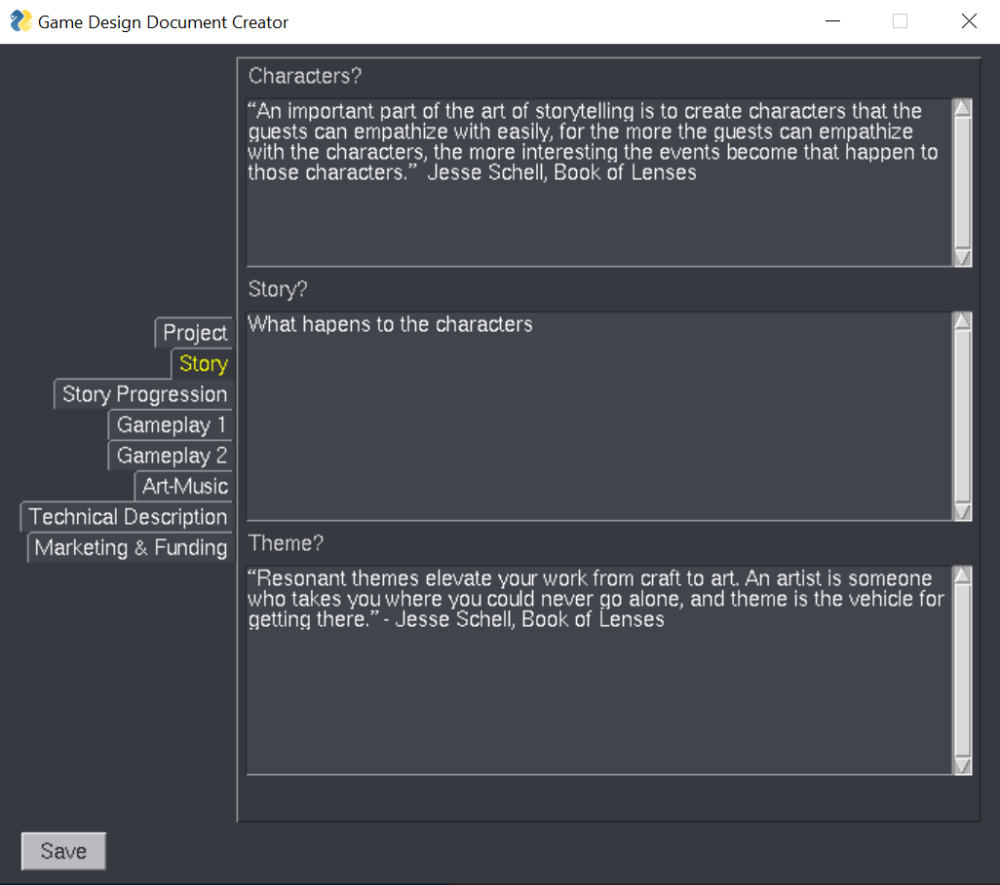

# GameDesignDocMarkdownTemplate
A game design document markdown generator

## Thanks Gamasutra!

This is based on [How to Write a Game Design Document](https://www.gamasutra.com/blogs/LeandroGonzalez/20160726/277928/How_to_Write_a_Game_Design_Document.php). A fun read.

## To use

Download the project, it requires Python 3.  

### Install Requirements

    pip install -r requirements.txt

### Run the generator

    python makeDoc.py

### Modify final output

You will find the output file generated in the output folder specified, or by default in the output folder.  Sample output is here [gameDoc.md](./output/gameDoc.md)

Good luck!

### Notes

I mostly made this to play with [PySimpleGUI](https://github.com/PySimpleGUI/PySimpleGUI), but it seems like it would be usable!

